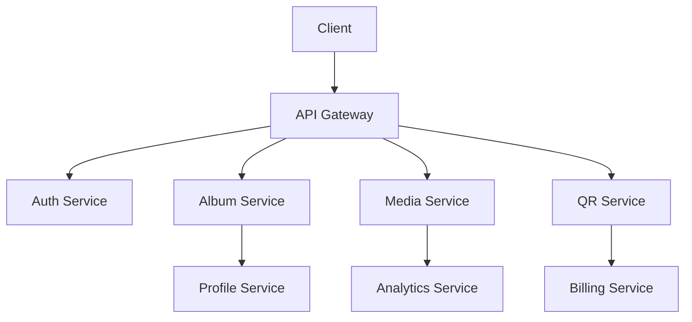
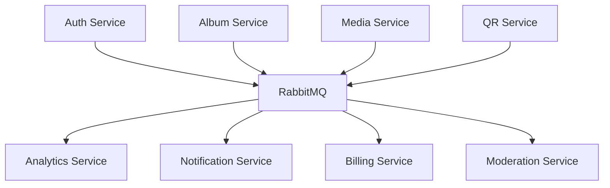
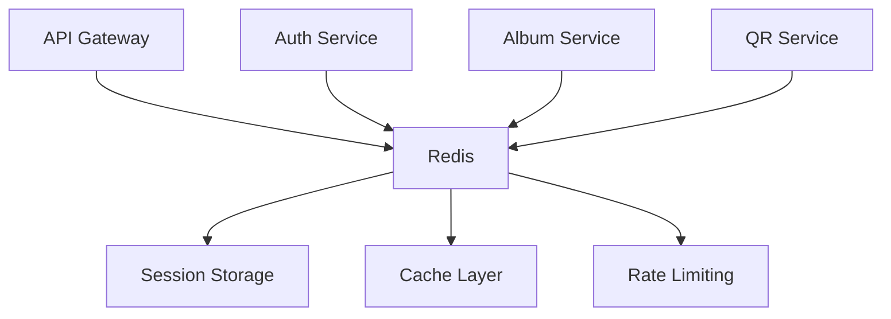
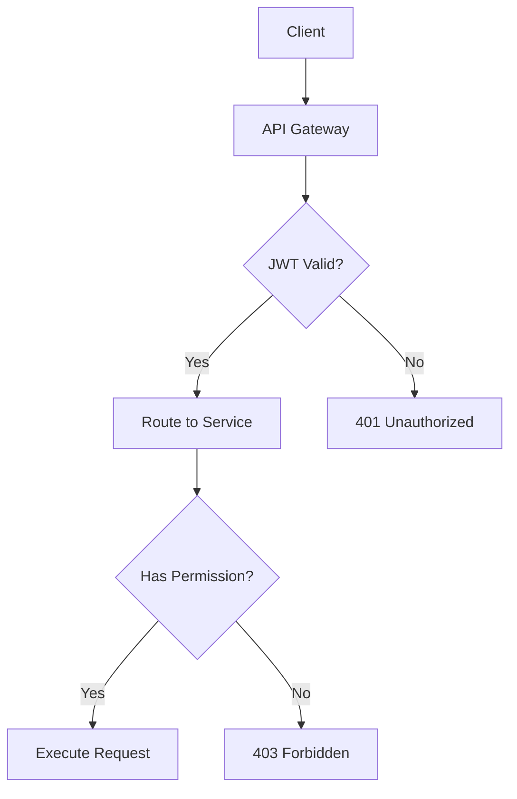

# 🏗️ Архитектура QR-Albums

## 📋 Содержание

1. [Обзор архитектуры](#обзор-архитектуры)
2. [Микросервисы](#микросервисы)
3. [Интеграция между сервисами](#интеграция-между-сервисами)
4. [База данных](#база-данных)
5. [Безопасность](#безопасность)
6. [Масштабируемость](#масштабируемость)
7. [Мониторинг](#мониторинг)

## 🎯 Обзор архитектуры

QR-Albums построен на микросервисной архитектуре, которая обеспечивает:

- **Масштабируемость** - Каждый сервис может масштабироваться независимо
- **Надежность** - Отказ одного сервиса не влияет на другие
- **Гибкость** - Легко добавлять новые функции и сервисы
- **Тестируемость** - Каждый сервис можно тестировать изолированно

### Принципы архитектуры

1. **Single Responsibility** - Каждый сервис отвечает за одну бизнес-функцию
2. **Loose Coupling** - Сервисы слабо связаны через API
3. **High Cohesion** - Внутри сервиса высокая связанность компонентов
4. **API-First** - Все взаимодействия через четко определенные API
5. **Stateless** - Сервисы не хранят состояние между запросами

## 🔧 Микросервисы

### 1. API Gateway (порт 8000)
**Назначение**: Единая точка входа для всех клиентских запросов

**Функции**:
- Маршрутизация запросов к соответствующим сервисам
- Аутентификация и авторизация
- Rate limiting и защита от DDoS
- Логирование и мониторинг запросов
- CORS настройки
- Кэширование ответов

**Технологии**: FastAPI, JWT, Redis

### 2. Auth Service (порт 8001)
**Назначение**: Управление аутентификацией и авторизацией

**Функции**:
- Регистрация и аутентификация пользователей
- Управление JWT токенами
- Восстановление паролей
- Управление ролями и разрешениями
- Верификация email

**Модели данных**:
- User (пользователи)
- UserRole (роли пользователей)
- PasswordReset (сброс паролей)

### 3. Album Service (порт 8002)
**Назначение**: Управление альбомами и страницами

**Функции**:
- CRUD операции с альбомами
- Управление страницами альбомов
- Публичные и приватные альбомы
- Поиск и фильтрация альбомов
- Статистика альбомов

**Модели данных**:
- Album (альбомы)
- Page (страницы альбомов)
- AlbumShare (совместное использование)

### 4. Media Service (порт 8003)
**Назначение**: Управление медиафайлами

**Функции**:
- Загрузка и хранение файлов
- Обработка изображений (resize, crop)
- Генерация превью
- Управление метаданными файлов
- Связь файлов с альбомами/страницами

**Модели данных**:
- MediaFile (медиафайлы)
- MediaMetadata (метаданные)
- MediaProcessing (обработка файлов)

### 5. QR Service (порт 8004)
**Назначение**: Генерация и управление QR кодами

**Функции**:
- Генерация QR кодов для страниц
- Кастомизация QR кодов (цвета, логотипы)
- Отслеживание сканирований
- Статистика использования QR кодов
- Управление жизненным циклом QR кодов

**Модели данных**:
- QRCode (QR коды)
- QRScan (сканирования)
- QRStats (статистика)

### 6. User Profile Service (порт 8005)
**Назначение**: Управление профилями пользователей

**Функции**:
- CRUD операции с профилями
- Настройки пользователей
- Аватарки и метаданные
- Предпочтения и конфигурация
- История активности

**Модели данных**:
- UserProfile (профили)
- UserSettings (настройки)
- UserActivity (активность)

### 7. Analytics Service (порт 8006)
**Назначение**: Аналитика и отчетность

**Функции**:
- Сбор и анализ данных сканирований
- Генерация отчетов
- Дашборды и визуализация
- Экспорт данных
- Аналитика использования

**Модели данных**:
- AnalyticsEvent (события)
- AnalyticsReport (отчеты)
- AnalyticsDashboard (дашборды)

### 8. Billing Service (порт 8007)
**Назначение**: Управление подписками и платежами

**Функции**:
- Управление тарифными планами
- Обработка подписок
- Интеграция с платежными системами
- Управление лимитами
- История транзакций

**Модели данных**:
- Subscription (подписки)
- BillingPlan (тарифные планы)
- Transaction (транзакции)
- UsageLimit (лимиты использования)

### 9. Notification Service (порт 8008)
**Назначение**: Отправка уведомлений

**Функции**:
- Email уведомления
- Push уведомления
- Шаблоны сообщений
- Очереди уведомлений
- Настройки пользователей

**Модели данных**:
- Notification (уведомления)
- NotificationTemplate (шаблоны)
- NotificationQueue (очереди)
- NotificationSettings (настройки)

### 10. Moderation Service (порт 8009)
**Назначение**: Модерация контента

**Функции**:
- AI-модерация контента
- Ручная модерация
- Журнал модерации
- Правила модерации
- Интеграция с AI сервисами

**Модели данных**:
- ModerationRequest (запросы модерации)
- ModerationRule (правила)
- ModerationLog (журнал)
- ModerationResult (результаты)

### 11. Print Service (порт 8010)
**Назначение**: Генерация PDF и печать

**Функции**:
- Генерация PDF этикеток
- Интеграция с WeasyPrint
- Кастомизация макетов
- Очереди печати
- Управление шаблонами

**Модели данных**:
- PrintJob (задания печати)
- PrintTemplate (шаблоны)
- PrintLayout (макеты)
- PrintQueue (очереди)

### 12. Scan Gateway (порт 8011)
**Назначение**: Обработка сканирований QR кодов

**Функции**:
- Обработка сканирований
- Редирект на соответствующие страницы
- Логирование сканирований
- Аналитика сканирований
- Защита от спама

## 🔗 Интеграция между сервисами

### Синхронная интеграция (HTTP)



**Используемые технологии**:
- HTTP/HTTPS для REST API
- JSON для обмена данными
- JWT для аутентификации
- Retry механизмы для надежности

### Асинхронная интеграция (RabbitMQ)



**Типы событий**:
- `user.registered` - Регистрация пользователя
- `album.created` - Создание альбома
- `qr.scanned` - Сканирование QR кода
- `media.uploaded` - Загрузка медиафайла
- `subscription.expired` - Истечение подписки

### Кэширование (Redis)



**Использование Redis**:
- Кэширование часто запрашиваемых данных
- Хранение сессий пользователей
- Rate limiting
- Временное хранение токенов

## 🗄️ База данных

### Стратегия базы данных

Каждый микросервис имеет свою собственную базу данных (Database per Service):

```
┌─────────────────┐    ┌─────────────────┐    ┌─────────────────┐
│   Auth DB       │    │   Album DB      │    │   Media DB      │
│   (PostgreSQL)  │    │   (PostgreSQL)  │    │   (PostgreSQL)  │
└─────────────────┘    └─────────────────┘    └─────────────────┘
         │                       │                       │
         ▼                       ▼                       ▼
┌─────────────────┐    ┌─────────────────┐    ┌─────────────────┐
│   QR DB         │    │   Profile DB    │    │ Analytics DB    │
│   (PostgreSQL)  │    │   (PostgreSQL)  │    │   (PostgreSQL)  │
└─────────────────┘    └─────────────────┘    └─────────────────┘
```

### Миграции

Каждый сервис использует Alembic для управления миграциями:

```bash
# Создание миграции
alembic revision --autogenerate -m "Description"

# Применение миграций
alembic upgrade head

# Откат миграций
alembic downgrade -1
```

### Связи между сервисами

Связи между данными разных сервисов поддерживаются через:

1. **Идентификаторы** - Каждый сервис знает ID сущностей других сервисов
2. **События** - Изменения данных передаются через события
3. **API вызовы** - Прямые запросы для получения связанных данных
4. **Кэширование** - Кэширование связанных данных для производительности

## 🔒 Безопасность

### Аутентификация и авторизация



**Механизмы безопасности**:
- JWT токены для аутентификации
- RBAC (Role-Based Access Control) для авторизации
- Rate limiting для защиты от DDoS
- CORS настройки
- Валидация входных данных
- SQL injection защита через ORM

### Защита данных

- **Шифрование паролей** - bcrypt с солью
- **HTTPS** - Обязательное использование в продакшене
- **Валидация данных** - Pydantic модели для валидации
- **Логирование** - Аудит всех операций
- **Резервное копирование** - Регулярные бэкапы БД

## 📈 Масштабируемость

### Горизонтальное масштабирование

```yaml
# docker-compose.yml
services:
  auth-svc:
    image: qr-albums/auth-svc:latest
    deploy:
      replicas: 3
    environment:
      - DATABASE_URL=postgresql://...
      - REDIS_URL=redis://...
```

### Вертикальное масштабирование

```yaml
services:
  auth-svc:
    image: qr-albums/auth-svc:latest
    deploy:
      resources:
        limits:
          memory: 1G
          cpus: '0.5'
```

### Стратегии масштабирования

1. **Stateless сервисы** - Легко масштабируются горизонтально
2. **Кэширование** - Redis для снижения нагрузки на БД
3. **Асинхронная обработка** - RabbitMQ для фоновых задач
4. **Load balancing** - Распределение нагрузки между инстансами
5. **Database sharding** - Разделение данных по шардам (планируется)

## 📊 Мониторинг

### Health Checks

Каждый сервис предоставляет endpoint для проверки здоровья:

```http
GET /health
```

**Ответ**:
```json
{
  "status": "healthy",
  "timestamp": "2024-01-01T00:00:00Z",
  "version": "1.0.0",
  "dependencies": {
    "database": "healthy",
    "redis": "healthy",
    "rabbitmq": "healthy"
  }
}
```

### Логирование

**Структурированные логи**:
```json
{
  "timestamp": "2024-01-01T00:00:00Z",
  "level": "INFO",
  "service": "auth-svc",
  "message": "User authenticated successfully",
  "user_id": 123,
  "request_id": "req-456"
}
```

### Метрики (планируется)

- **Prometheus** - Сбор метрик
- **Grafana** - Визуализация метрик
- **Jaeger** - Трассировка запросов
- **ELK Stack** - Централизованное логирование

## 🚀 Развертывание

### Docker Compose

```bash
# Продакшен
docker-compose up -d

# Разработка
docker-compose -f docker-compose.dev.yml up -d
```

### Kubernetes (планируется)

```yaml
apiVersion: apps/v1
kind: Deployment
metadata:
  name: auth-svc
spec:
  replicas: 3
  selector:
    matchLabels:
      app: auth-svc
  template:
    metadata:
      labels:
        app: auth-svc
    spec:
      containers:
      - name: auth-svc
        image: qr-albums/auth-svc:latest
        ports:
        - containerPort: 8001
```

## 🔄 CI/CD (планируется)

```yaml
# .github/workflows/ci.yml
name: CI/CD Pipeline
on: [push, pull_request]
jobs:
  test:
    runs-on: ubuntu-latest
    steps:
      - uses: actions/checkout@v2
      - name: Run tests
        run: make test
      - name: Build Docker images
        run: docker-compose build
      - name: Deploy to staging
        run: docker-compose -f docker-compose.staging.yml up -d
```

## 📚 Дополнительные ресурсы

- [API Документация](API.md)
- [Руководство по развертыванию](DEPLOYMENT.md)
- [Руководство разработчика](DEVELOPER.md)
- [FAQ](FAQ.md)

---

*Документация обновлена: 2024-01-01*
